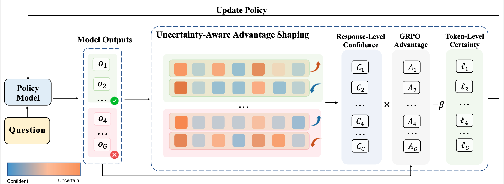
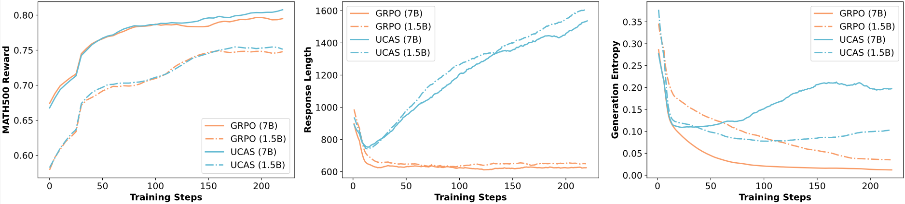

<div align="center">
<a id="readme-top"></a>
<h1>
  
  UCAS: Uncertainty-aware Advantage Shaping for RLVR
</h1>
<h3 align="center"><strong>🎉🎉 ACL 2026 Findings 🎉🎉</strong></h3>
<a href="https://arxiv.org/abs/2510.10649"></a>

**Unlocking Exploration in RLVR: Uncertainty-aware Advantage Shaping for Deeper Reasoning**

Can Xie, Ruotong Pan, Xiangyu Wu, Yunfei Zhang, Jiayi Fu, Tingting Gao, Guorui Zhou

Kuaishou Technology

</div>

## Table of Contents
- [💡 Overview](#-Overview)
- [⚙️ Installation](#-Installation)
- [📦 Data Preparation](#-Data-Preparation)
- [🔥 Training](#-Training)
- [📈 Evaluation](#-Evaluation)
- [📝 Citation](#-Citation)
- [🙏 Acknowledgement](#-Acknowledgement)

<p align="right"><a href="#readme-top"></a></p>

## 💡 Overview

**UCAS** is a plug-in advantage reshaping method for RLVR that uses the model's own uncertainty signals to mitigate entropy collapse and encourage deeper exploration:

- 🔵 **Stage 1 — Response-Level Modulation.** Amplifies rewards for correct-but-uncertain responses and penalties for incorrect-but-confident ones, via z-scored self-confidence weighting.
- 🟠 **Stage 2 — Token-Level Certainty Penalty.** Subtracts a min-max normalized token logit score from the advantage, suppressing locally overconfident updates.

<div align="center">
  
</div>

<div align="center">
  
  <p><em>UCAS vs. GRPO: higher reward, longer responses, and sustained generation entropy throughout training.</em></p>
</div>

<p align="right"><a href="#readme-top"></a></p>


## ⚙️ Installation

Follow the standard verl installation:

```bash
git clone https://github.com/xvolcano02/UCAS.git && cd UCAS
conda create -n ucas python=3.10 -y && conda activate ucas
pip install -r requirements.txt
pip install -e .
```

See the [verl documentation](https://verl.readthedocs.io/en/latest/start/install.html) for full environment setup (CUDA, NCCL, Flash Attention, etc.).

<p align="right"><a href="#readme-top"></a></p>

## 📦 Data Preparation

1. Download MATH 

Download the complete MATH dataset from [MATH](https://huggingface.co/datasets/hiyouga/math12k) and filter the levels 3-5 to `/path/to/data/math-level-3-5`

2. Data Format Process to adapt to verl

```bash
# Math (MATH levels 3–5)
python examples/data_preprocess/math_dataset_process.py --local_dir /path/to/data/math-level-3-5
```

<p align="right"><a href="#readme-top"></a></p>

## 🔥 Training

### UCAS on Qwen2.5-Math-7B (recommended)

Config `train_ucas_math_7b.sh` to set your model and data paths, then:

```bash
# GRPO baseline
# bash math_grpo.sh
bash train_ucas_math_7b.sh
```

<p align="right"><a href="#readme-top"></a></p>

## 📈 Evaluation

We provide evaluation scripts under `eval/` based on [vLLM](https://github.com/vllm-project/vllm). Supported benchmarks: AIME24, AIME25, MATH-500, AMC23, Minerva Math, OlympiadBench.

**Step 1 — (Optional) Convert FSDP checkpoint to HuggingFace format:**
```bash
python scripts/convert_ckpt.py /path/to/fsdp_checkpoint /path/to/base_model /path/to/output_model
```

**Step 2 — Run evaluation:**
```bash
cd eval
python eval_baseline.py \
    --model_name /path/to/your/model \
    --tasks aime24 math500 amc minerva olympiad_bench \
    --template qwen_math \
    --n_samples 1 \
    --temperatures 0.0 \
    --seeds 42 \
    --save True
```

Or use the provided script (edit `model_dirs` and `task` first):
```bash
cd eval
bash run_eval.sh
```

<p align="right"><a href="#readme-top"></a></p>

## 📝 Citation

If you find this work useful, please cite:

```bibtex
@article{xie2025unlocking,
  title={Unlocking exploration in rlvr: Uncertainty-aware advantage shaping for deeper reasoning},
  author={Xie, Can and Pan, Ruotong and Wu, Xiangyu and Zhang, Yunfei and Fu, Jiayi and Gao, Tingting and Zhou, Guorui},
  journal={arXiv preprint arXiv:2510.10649},
  year={2025}
}
```

<p align="right"><a href="#readme-top"></a></p>

## 🙏 Acknowledgement
Our work is primarily based on the following codebases: [verl](https://github.com/verl-project/verl), [Intuitor](https://github.com/sunblaze-ucb/Intuitor). We are sincerely grateful for their work.

<p align="right"><a href="#readme-top"></a></p>
